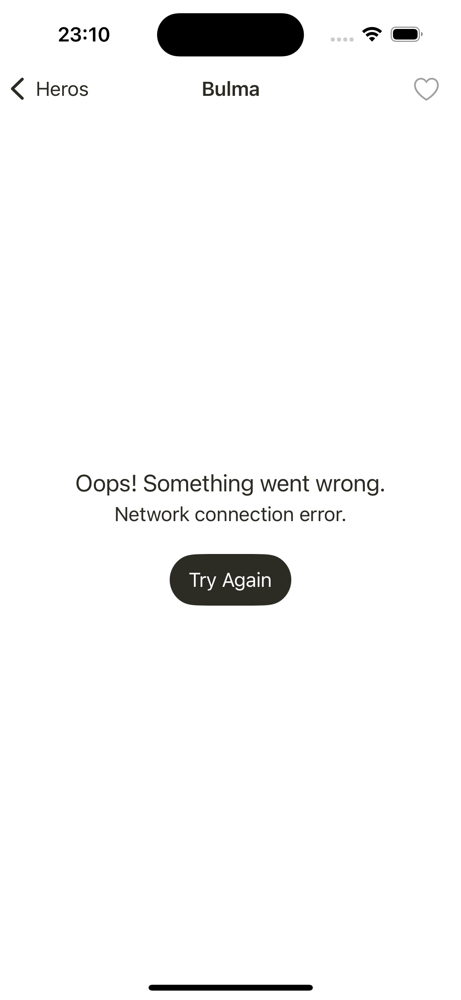
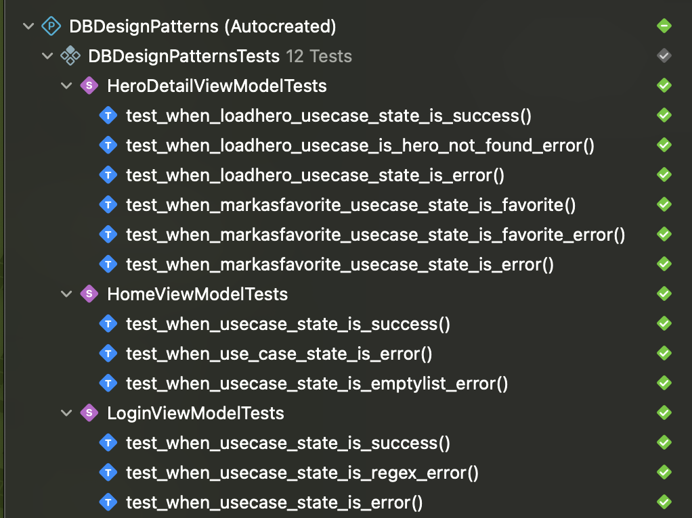

# Dragon Ball, Design Patterns version

This project implements some of the most common **Design Patterns** to solve specific things, in general uses a modified version of **Clean Architecture** (Uncle Bob) to separates concerns into indepenent layers, and uses **MVVM** design pattern for the **Presentation** layer.

## Screen
| Full App | Error Screen |
|--------|--------|
|   |  |

## Project structure
From innner to outer layers:

- Presentation (UI Layer)
	- **XIB and Controllers** to handle user interaction and display UI, here the **Adapter** design pattern is used to adapt a domain model to a cell
	- **View Models**  to handle ui logic and update it using the **State** design pattern and communicate with uses cases
	- **Builders** for object creations using the **Builder** design pattern such a controller instances
- Domain (Domain and Application layer)
	- **Models** for bussines logic
	- **UseCases** to communicate with requests to fetch data
- Data (Repository Layer)
	- **DataSource** to persist data using the **Singleton** design pattern
	- **Entities** for api models (data transfer objects)
	- **Mappers** to transform dto objects to domain models using the **Mapper** design pattern
	- **Requests** to handle api requests and communicates with API Client
- Infrastructure
	- **Networking** to perform API calls and intercepts request using the **Interceptor** design pattern
	- **Logging** to save a Logger xd

## Testing

